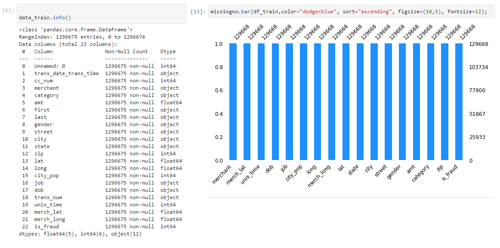
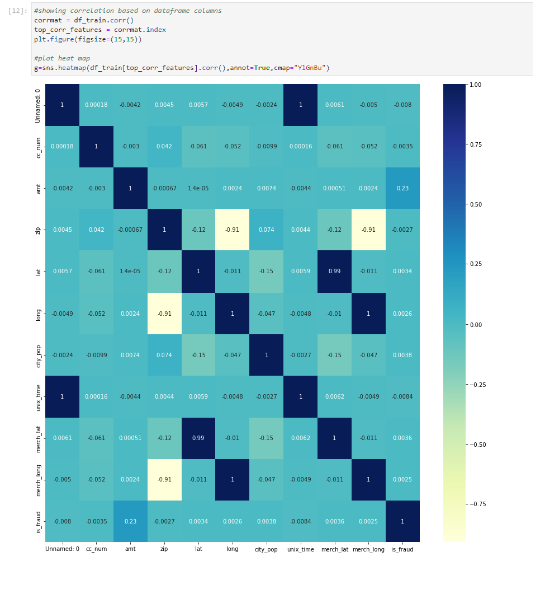
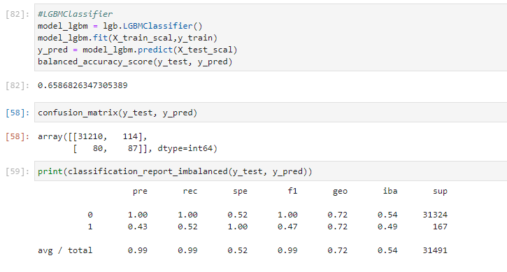

[^1]

---
# **Business Problem**

 >*"Americans reported 271,823 cases of credit card fraud in 2019. This is an increase of 72.4 percent from 2018, when there were 157,715 cases of credit card fraud reported."*[^2]

 >*"Losses from fraud involving cards used for payment worldwide reached $27.85 billion in 2018. They are projected to rise to $35.67 billion in five years and $40.63 billion in 10 years."*[^3]

### **Problem Statement** :

Manual filtering process can be lenghty and costly process, it will required time and human resources, when business these day wouldn't have enough resources to do so.

### **Goals** :

To eliminate process of manual filtering process and increase efficiency by developing machine learning to predict the fraudulent transaction with high accuracy. To help businesses to focus on other areas so business can achieve other goals.

---

# **Requirements**

[^a] Install the required library

[^b] Import the required library

---

# **About the Dataset**

[^4] ***Please download the dataset from Kaggl to run code, link in footnote***

"This is a simulated credit card transaction dataset containing legitimate and fraud transactions from the duration 1st Jan 2019 - 31st Dec 2020. It covers credit cards of 1000 customers doing transactions with a pool of 800 merchants.

### **Source of Simulation** :

This was generated using Sparkov Data Generation | Github tool created by Brandon Harris. This simulation was run for the duration - 1 Jan 2019 to 31 Dec 2020. The files were combined and converted into a standard format." [^5]

---

# **Anaylsis & Clean the Dataset**
### ****Garbage in Garbage out, your analysis is as good as your data****

[^6] Checking for missing data, identifying datatype. crucial that the analysis has no missing data

[^7] Deep dive via loop function through dataset

[^8] Using a heatmap shows correlation between columns. The columns that didn't correlate is dropped along with "Unnamed: 0" presenting negative vaules. 

[^9] Removing unnecessary column from data

[^10]
Coding to convert D.O.B to Age (intager)

---

# **Cleaned Dataset**

[^11] Approx 0.5% of fruad transaction in dataset

[^12] Dataset to use for training machine model

---

# **Encoding Dataset**

[^13] Encode cleaned dataset

[^14] Output of Encode cleaned dataset

---

# **Spliting dataset**

[^15] Using a fraction of cleaned dataset

---

# **Normalize Dataset**

[^16] Normalize to train machine model

---
# **First Machine Model: Logistic Regression Imbalanced Dataset**

[^17] Imbalanced Dataset through Logistic Regression Machine Model. 100% Non-frudulant prediction, 42% frudulant prediction. Average total 99% accurate machine model, biased to non-frudulant transaction prediction

---
# **Second Machine Model: KNeighboursClassifier Imbalanced Dataset**

[^18] Imbalanced Dataset through KNeighboursClassifier Machine Model. 99% Non-frudulant prediction, 0% frudulant prediction. Average total 99% accurate machine model, biased to non-frudulant transaction prediction

---
# **Third Machine Model: LGBClassifier Imbalanced Dataset**

[^19] Imbalanced Dataset through LGBClassifier Machine Model. 99% Non-frudulant prediction, 43% frudulant prediction. Average total 99% accurate machine model, biased to non-frudulant transaction prediction

---
# **Balance is Key!!**

[^20] Apply Random under-sampling to balance biased dataset

[^21] Output of balanced Dataset

---
# **Preparing for Machine Learning**

[^22] Spliting and normalize balanced dataset

---
# **First Machine Learning Regression, Balanced Dataset**

[^23] Balanced Dataset through Logistic Regression Machine Model. 75% Non-frudulant prediction, 64% frudulant prediction. Average total 69% accurate machine model of fradulant transaction

# **Second Machine LGBMClassifier, Balanced Dataset**

[^24] Balanced Dataset through LBGClassifier Machine Model. 79% Non-frudulant prediction, 68% frudulant prediction. Average total 74% accurate machine model of fradulant transaction

 ---
# **To conclude** 

**This Machine** is able to predict fradulant credit card transaction to 74% accuracy, it has been trained with good data only. Meaning bad data has been removed via human logic and column correlation analysis.

At first the data was left unbalanced and fitted to three different machine learning models, all three indicated biased prediction to the majority of the data being non-fradulant, as expected.

The machine needed to be trained with balanced data. Using the previous supervised machine learning - Logistics regression. This popular model predicts binary event occuring i.e. fradulant, non-fradulant. It is used for predicting the categorical dependent variable using a given set of independent variables. Achieving a total average of 69% accuracy predicting fradulant transactions.

The second machine learning model LGBM Classifier out performed Logistical regression by 5% fianilsing at 74% total average. "Light GBM is a gradient boosting framework that uses tree based learning algorithm. It grows tree vertically while other algorithm grows trees horizontally meaning that Light GBM grows tree leaf-wise while other algorithm grows level-wise. Leaf-wise algorithm can reduce more loss than a level-wise algorithm.

**WHY USE LGB?**

It is ‘Light’ because of its high speed. It can handle large data, requires low memory to run and focuses on accuracy of results. Also supports GPU learning and thus data scientists/ Kagglers are widely using LGBM for data science application development.

TIPS & TRICKS

The algorithm easily overfits and thus, should not be used with small (< 10K rows) datasets.
Deal with overfitting using these parameters:
Small Maximum Depth
Large Minimum Data in a Leaf
Small Feature and Bagging Fraction
Improve the training speed
Small Bagging Fraction
Early Stopping Round
Use small learning_rate with large num_iterations for better accuracy
Ideally, the value of num_leaves should be less than or equal to 2^(max_depth). Value more than this will result in overfitting
If you have a big enough dataset, use this algorithm at least once. It’s accuracy has challenged other boosting algorithms"[^25]

[^26] Mljar.com has tested many machine learning models against one another. We focused on Binary classificaiton between LGBM Classification vs Linear logistic regression model. LGBM classification is better 16:3 against Logistic regression. 

[^1]: machine-learning https://intotomorrow.com/how-machine-learning-can-help-credit-card-fraud-detection/

[^2]: Credit Card Frauds Top the List of US Identity Theft Crimes with 270,000 Reports in 2019 https://www.precisesecurity.com/articles/credit-card-frauds-top-the-list-of-us-identity-theft-crimes-with-270000-reports-in-2019/

[^3]: Payment Card Fraud Losses Reach $27.85 Billion - Annual Fraud Statistics Released by The Nilson Report https://www.prnewswire.com/news-releases/payment-card-fraud-losses-reach-27-85-billion-300963232.html

[^4]: Download dataset via link https://www.kaggle.com/datasets/kartik2112/fraud-detection

[^5]: Credit Card Transactions Fraud Detection Dataset  https://www.kaggle.com/datasets/kartik2112/fraud-detection

[^6]: Check and identify dataset, ***Own Code***

[^7]: Loop through dataset for deep dive, ***Own Code***

[^8]: Heatmap for coorrelation, ***Own Code***

[^a]: Install the required library, ***Own Code***

[^b]: Import the required library, ***Own Code***

[^9]: Removing Garbage Data, ***Own Code***

[^10]: Coding to convert D.O.B to Age,  3.3 Converting dob to age, https://github.com/sharmasapna/credit-card-fraud-detection/blob/main/credit-card-fraud-detection.ipynb

[^11]: Imbalanced Dataset. Approx 0.5% of fruad transaction in dataset, ***Own Code***

[^12]:  Dataset to use for training machine model, ***Own Code***

[^13]: Encode cleaned dataset, ***Own Code***

[^14]: Output of Encode cleaned dataset, ***Own Code***

[^15]: Using a fraction of cleaned dataset, ***Own Code**

[^16]: Normalize to train machine model, ***Own Code***

[^17]: Imbalanced Dataset through Logistic Regression Machine Model. 100% Non-frudulant prediction, 42% frudulant prediction. Average total 99% accurate machine model. ***Own Code***

[^18]: Imbalanced Dataset through KNeighboursClassifier Machine Model. 99% Non-frudulant prediction, 0% frudulant prediction. Average total 99% accurate machine model, biased to non-frudulant transaction prediction ***Own Code***

[^19]: Imbalanced Dataset through LGBClassifier Machine Model. 99% Non-frudulant prediction, 43% frudulant prediction. Average total 99% accurate machine model, biased to non-frudulant transaction prediction. ***Own Code***

[^20]: Apply Random under-sampling to balance biased dataset, ***Own Code***

[^21]: Output of balanced Dataset, ***Own Code***

[^22]: Spliting and normalize balanced dataset, ***Own Code***

[^23]: Balanced Dataset through Logistic Regression Machine Model. 75% Non-frudulant prediction, 64% frudulant prediction. Average total 69% accurate machine model of fradulant transaction, ***Own Code***

[^24]: Balanced Dataset through LBGClassifier Machine Model. 79% Non-frudulant prediction, 68% frudulant prediction. Average total 74% accurate machine model of fradulant transaction, ***Own Code***

[^25]: Light Gradient Boosting Method, https://www.kaggle.com/code/krithi07/logistic-to-lightgbm-for-beginners/notebook

[^26]: Lightgbm vs Linear, https://mljar.com/machine-learning/lightgbm-vs-linear/