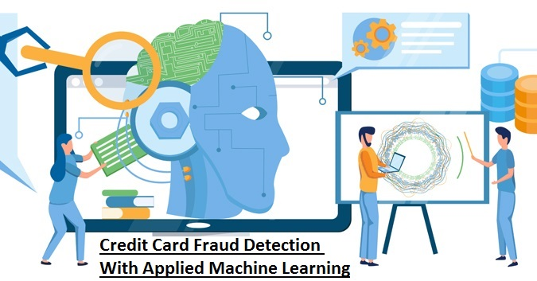
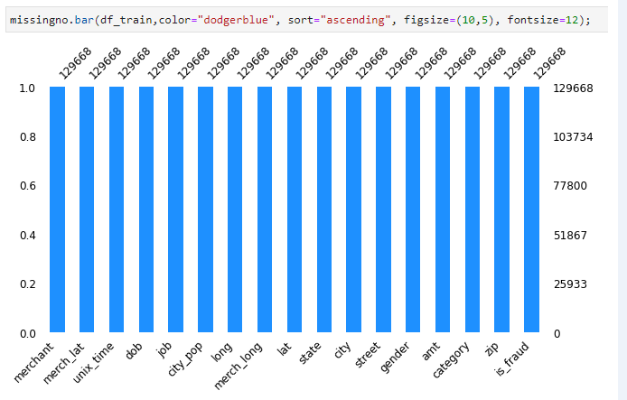
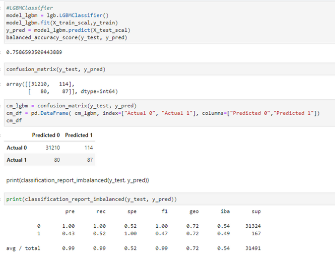

[^1]

---
# **Backgorund**

 >*"Americans reported 271,823 cases of credit card fraud in 2019. This is an increase of 72.4 percent from 2018, when there were 157,715 cases of credit card fraud reported."*[^2]

 >*"Losses from fraud involving cards used for payment worldwide reached $27.85 billion in 2018. They are projected to rise to $35.67 billion in five years and $40.63 billion in 10 years."*[^3]

Context:

As most of Transaction payment online is done with credit card. Everyday there are millions of credit card transaction. 
Businesses is trying to predict which transaction is legitimate and lowering the risk of loss. This project we decided to develop supervise machine learning .

Our Target :

0: non-fraudulent
1: fraudulent transaction

Problem Statement :

Manual filtering process can be lenghty and costly process, it will required time and human resources, when business these day wouldn't have enough resources to do so.

Goals :

To eliminate process of manual filtering process and increase efficiency by developing machine learning to predict the fraudulent transaction with high accuracy. To help businesses to focus on other areas so business can achieve other goals.

Find our presentation [here](https://github.com/joannemannuella/Project_2/tree/main/documentations)
---

# **Requirements**

[^a] Install the required library

[^b] Import the required library

---

# **About the Dataset**

[^4] ***Please download the dataset from [Kaggle](https://www.kaggle.com/datasets/kartik2112/fraud-detection) to run code***

"This is a simulated credit card transaction dataset containing legitimate and fraud transactions from the duration 1st Jan 2019 - 31st Dec 2020. It covers credit cards of 1000 customers doing transactions with a pool of 800 merchants.

### **Source of Simulation** :

This was generated using Sparkov Data Generation | Github tool created by Brandon Harris. This simulation was run for the duration - 1 Jan 2019 to 31 Dec 2020. The files were combined and converted into a standard format." [^5]

---

# **Anaylsis & Clean the Dataset**
### ****Garbage in Garbage out, your analysis is as good as your data****

****Data Cleaning Process and Data Preperation****

[^6] Slicing the data by taking only Fraction of data after printing the info .

Data frame consist of 1296675 rows and 23 columns.

to run faster model we using 10 % of training data and 5 % of test data from original data frames.

[^7] Deep dive via loop function through dataset

[^8] Plot correlation matrix to help gauging  between columns to drop unnecessary columns also applying simple logic to determine the features 

The columns we drop:

"Unnamed" because it only contains indexes and is not useful to our machine learning.

Second we will dropped "trans_date_trans_time" since we have unix_time

The third column customer card number .

We will dropped "first name" and "last name" dropped.

Transaction number is it really necessary?  we also think it won't be really needed.

Using missingno function to plot that current columns doesn't have missing value. 

[^10]
Using a function to convert D.O.B to Age (integer)

[^12] Test and train dataframe to concatinated to be fitted in machine learning model

[^11] The figure show that the data is imbalance, meaning there is not equal distribution of 

0: non-fraudulent
1: fraudulent 

---

# **Encoding Dataset**

[^13] Creating function to convert categorical variables to one hot encoding

[^14] Output of Encode cleaned dataset

---

# **Spliting dataset**

[^15] Spliting dataset  Into Train and Test using sklearn library from
 sklearn.model_selection import train_test_split

---

# **Normalize Dataset**

[^16] Normalize to train machine model

---
# **First Machine Model: Logistic Regression Imbalanced Dataset**

Logistic regression is one of the most popular Machine Learning algorithms, which comes under the Supervised Learning technique. It is used for predicting the categorical dependent variable using a given set of independent variables.

[^17] Imbalanced Dataset through Logistic Regression Machine Model. 100% Non-frudulant prediction, 42% frudulant prediction. Average total 99% accurate machine model, biased to non-frudulant transaction prediction

---
# **Second Machine Model: KNeighboursClassifier Imbalanced Dataset**

[^18] Imbalanced Dataset through KNeighboursClassifier Machine Model. 99% Non-fraudulent prediction, 0% fraudulent prediction. Average total 99% accurate machine model, biased to non-frudulant transaction prediction

---
# **Third Machine Model: LGBClassifier Imbalanced Dataset**

[^19] Imbalanced Dataset through LGBClassifier Machine Model. 99% Non-fraudulent prediction, 43% fraudulent prediction. Average total 99% accurate machine model, biased to non-fraudulent transaction prediction

---
# **Balance is Key!!**

[^20] Apply Random under-sampling to balance biased dataset

[^21] Output of balanced Dataset

---
# **Preparing for Machine Learning**

[^22] Spliting and normalize balanced dataset

---
# **First Machine Learning Regression, Balanced Dataset**

[^23] This model show although the average accuracy and prediction is less compared to imbalanced data, but it showed improvement of the prediction of 1(fraudulent) from 0.42(42%) to 0.64 (64%) which is our main goal of developing this Machine Learning.

# **Second Machine KNeighboursClassifier, Balanced Dataset**

[^C] This model show although the average accuracy and prediction is less compared to imbalanced data, but it showed improvement of the prediction of 1(fraudulent) from 0%(0%) to 0.57 (57%) which is our main goal of developing this Machine Learning .

# **Third Machine LGBMClassifier, Balanced Dataset**

[^24] This model show although the average accuracy and prediction is less compared to imbalanced data, but it showed an improvement of the prediction of 1(fraudulent) from 0.43%(43%) to 0.66 (66%) which is our main goal of developing this Machine Learning.

 ---
# **To conclude** 

**This Machine** is able to predict fraudulent credit card transaction to 72% accuracy, it has been trained with good data only. Meaning bad data has been removed via human logic and column correlation analysis.

At first the data was left unbalanced and fitted to three different machine learning models, all three indicated biased prediction to the majority of the data being non-fraudulent, as expected.

The machine needed to be trained with balanced data. Using the previous supervised machine learning - Logistics regression. This popular model predicts binary event occuring i.e. fraudulent, non-fraudulent. It is used for predicting the categorical dependent variable using a given set of independent variables. Achieving a total average of 69% accuracy predicting fraudulent transactions.

The third machine learning model LGBM Classifier out performed Logistical regression by 1% fianilsing at 72% total average. "Light GBM is a gradient boosting framework that uses tree based learning algorithm. It grows tree vertically while other algorithm grows trees horizontally meaning that Light GBM grows tree leaf-wise while other algorithm grows level-wise. Leaf-wise algorithm can reduce more loss than a level-wise algorithm.

**WHY USE LGB?**

It is ‘Light’ because of its high speed. It can handle large data, requires low memory to run and focuses on accuracy of results. Also supports GPU learning and thus data scientists/ Kagglers are widely using LGBM for data science application development.

TIPS & TRICKS

The algorithm easily overfits and thus, should not be used with small (< 10K rows) datasets.
Deal with overfitting using these parameters:
Small Maximum Depth
Large Minimum Data in a Leaf
Small Feature and Bagging Fraction
Improve the training speed
Small Bagging Fraction
Early Stopping Round
Use small learning_rate with large num_iterations for better accuracy
Ideally, the value of num_leaves should be less than or equal to 2^(max_depth). Value more than this will result in overfitting
If you have a big enough dataset, use this algorithm at least once. It’s accuracy has challenged other boosting algorithms"[^25]

[^26] Mljar.com has tested many machine learning models against one another. We focused on Binary classificaiton between LGBM Classification vs Linear logistic regression model. LGBM classification is better 16:3 against Logistic regression. 

[^1]: machine-learning https://intotomorrow.com/how-machine-learning-can-help-credit-card-fraud-detection/

[^2]: Credit Card Frauds Top the List of US Identity Theft Crimes with 270,000 Reports in 2019 https://www.precisesecurity.com/articles/credit-card-frauds-top-the-list-of-us-identity-theft-crimes-with-270000-reports-in-2019/

[^3]: Payment Card Fraud Losses Reach $27.85 Billion - Annual Fraud Statistics Released by The Nilson Report https://www.prnewswire.com/news-releases/payment-card-fraud-losses-reach-27-85-billion-300963232.html

[^4]: Download dataset via link https://www.kaggle.com/datasets/kartik2112/fraud-detection

[^5]: Credit Card Transactions Fraud Detection Dataset  https://www.kaggle.com/datasets/kartik2112/fraud-detection

[^6]: Check and identify dataset, https://github.com/sharmasapna/credit-card-fraud-detection/blob/main/credit-card-fraud-detection.ipynb

[^7]: Loop through dataset for deep dive, https://github.com/sharmasapna/credit-card-fraud-detection/blob/main/credit-card-fraud-detection.ipynb

[^8]: Heatmap for coorrelation, https://github.com/sharmasapna/credit-card-fraud-detection/blob/main/credit-card-fraud-detection.ipynb

[^a]: Install the required library, https://github.com/sharmasapna/credit-card-fraud-detection/blob/main/credit-card-fraud-detection.ipynb

[^b]: Import the required library, https://github.com/sharmasapna/credit-card-fraud-detection/blob/main/credit-card-fraud-detection.ipynb

[^9]: Removing Garbage Data, ***Own Code***

[^10]: Coding to convert D.O.B to Age,  3.3 Converting dob to age, https://github.com/sharmasapna/credit-card-fraud-detection/blob/main/credit-card-fraud-detection.ipynb

[^11]: Imbalanced Dataset. Approx 0.5% of fruad transaction in dataset, ***Own Code***

[^12]:  Dataset to use for training machine model, https://github.com/sharmasapna/credit-card-fraud-detection/blob/main/credit-card-fraud-detection.ipynb

[^13]: Encode cleaned dataset, https://github.com/sharmasapna/credit-card-fraud-detection/blob/main/credit-card-fraud-detection.ipynb

[^14]: Output of Encode cleaned dataset, ***Own Code***

[^15]: Using a fraction of cleaned dataset, https://github.com/sharmasapna/credit-card-fraud-detection/blob/main/credit-card-fraud-detection.ipynb

[^16]: Normalize to train machine model, ***Own Code***

[^17]: Imbalanced Dataset through Logistic Regression Machine Model. 100% Non-frudulant prediction, 42% frudulant prediction. Average total 99% accurate machine model. ***Own Code***

[^18]: Imbalanced Dataset through KNeighboursClassifier Machine Model. 99% Non-frudulant prediction, 0% frudulant prediction. Average total 99% accurate machine model, biased to non-frudulant transaction prediction ***Own Code***

[^19]: Imbalanced Dataset through LGBClassifier Machine Model. 99% Non-frudulant prediction, 43% frudulant prediction. Average total 99% accurate machine model, biased to non-frudulant transaction prediction. ***Own Code***

[^20]: Apply Random under-sampling to balance biased dataset, ***Own Code***

[^21]: Output of balanced Dataset, ***Own Code***

[^22]: Spliting and normalize balanced dataset, ***Own Code***

[^23]: This model show although the average accuracy and prediction is less compared to imbalanced data, but it showed improvement of the prediction of 1(fraudulent) from 0.42(42%) to 0.64 (64%) which is our main goal of developing this Machine Learning. ***Own Code***

[^24]:This model show although the average accuracy and prediction is less compared to imbalanced data, but it showed an improvement of the prediction of 1(fraudulent) from 0.43%(43%) to 0.66 (66%) which is our main goal of developing this Machine Learning. ***Own Code***

[^25]: Light Gradient Boosting Method, https://www.kaggle.com/code/krithi07/logistic-to-lightgbm-for-beginners/notebook

[^26]: Lightgbm vs Linear, https://mljar.com/machine-learning/lightgbm-vs-linear/

[^C]: This model show although the average accuracy and prediction is less compared to imbalanced data, but it showed improvement of the prediction of 1(fraudulent) from 0%(0%) to 0.57 (57%) which is our main goal of developing this Machine Learning. ***OwnCode***